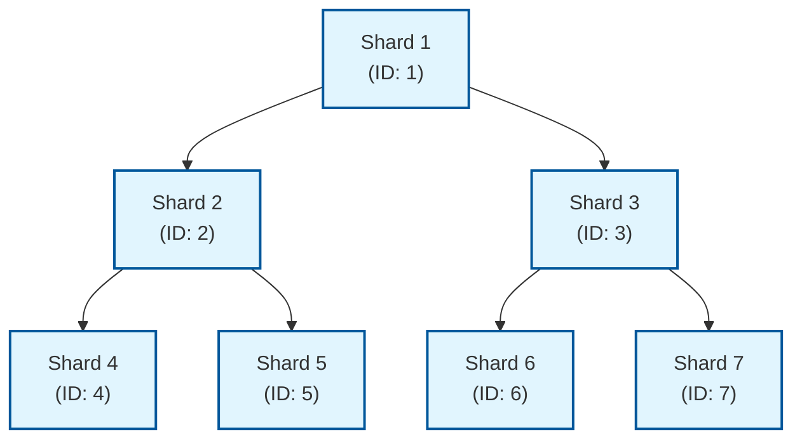

# ShardMatrix

ShardMatrix 是一个高性能的分片区块链平台，专注于可扩展性和效率。采用委托权益证明（DPoS）共识机制，支持稳定的交易处理。

## 项目概述

ShardMatrix 旨在提供一个创新、高效的区块链解决方案，通过独特的分片机制实现高可扩展性。与传统分片设计不同，ShardMatrix 中每个分片都是一条独立的链，但每个分片只保存相邻分片的区块头哈希（长度为3的数组），实现轻量级的分片间交互。

项目采用迭代开发策略，第一阶段专注于实现基础区块链功能和分片机制，后续阶段将逐步添加跨分片交易等高级特性。

## 核心特性

### 性能指标
- **区块间隔**: 固定2秒
- **区块大小**: 2MB（可调整）
- **验证节点**: 每个分片21个验证节点
- **分片数量**: 可动态扩展
- **性能目标**: 第一阶段以稳定性为主，后续优化性能

### 技术栈
- **开发语言**: Go
- **数据库**: LevelDB
- **网络库**: libp2p-go
- **序列化**: binary
- **共识算法**: DPoS（委托权益证明）
- **加密算法**: Ed25519 + SHA256

## 系统架构

ShardMatrix 采用创新的分片架构设计：

1. **应用层**: 客户端应用、钱包应用、API接口
2. **网络层**: P2P网络、节点发现、消息传播
3. **共识层**: DPoS共识、验证者管理、区块生产
4. **核心层**: 区块管理、交易处理、状态管理
5. **分片层**: 分片管理、跨分片通信、区块头哈希同步
6. **存储层**: LevelDB、索引存储

## 核心组件

### 区块结构
- 区块头包含区块序号、时间戳、前一个区块哈希、交易Merkle根等信息
- 创新性地包含当前分片ID和相邻分片的区块头哈希数组（长度为3）
- 区块体包含交易哈希列表

### 分片设计
- 每个分片都是一条独立的区块链
- 每个分片只保存相邻分片的区块头哈希（长度为3的数组）
- 相邻分片的定义：
  - 父分片：`shardID = self.ShardID / 2`
  - 左子分片：`shardID = self.ShardID * 2`
  - 右子分片：`shardID = self.ShardID * 2 + 1`

分片树结构示例：

相邻分片关系示例：
- 分片1的相邻分片：无父分片，左子分片2，右子分片3
- 分片2的相邻分片：父分片1，左子分片4，右子分片5
- 分片3的相邻分片：父分片1，左子分片6，右子分片7
- 分片4的相邻分片：父分片2，无左子分片，无右子分片

### 创世区块设计
- 第一个分片（ShardID=1）通过配置文件保证网络的创世区块生成
- 子分片通过在第一分片的交易创建，经过一段时间的公示期后确认参数
- 公示期过后，参数确定，能够确认指定分片的创世区块所需的所有信息
- 所有的创世区块都不需要签名
- 创世区块的时间戳基于创建分片的时间，确保所有节点生成相同的创世区块

### 交易模型
- 支持基本转账功能
- 包含发送方地址、接收方地址、转账金额等字段
- 通过数字签名确保交易安全
- 包含分片ID字段，用于标识交易所属的分片
- 使用Gas机制（GasPrice和GasLimit）计算交易费用

### 委托权益证明共识机制（DPoS）
- 每个分片固定21个验证节点
- 基于投票权重的验证者选择
- 轮流出块机制
- 即时确认（简化版）

## 存储设计

采用 LevelDB 作为底层存储引擎，支持：
- 按分片组织的区块数据持久化存储
- 按分片组织的交易数据存储
- 按分片组织的账户状态管理
- 按分片组织的验证者信息存储
- 支持按区块哈希和高度快速查询
- 简单地将不同的分片都单独存储

## 网络拓扑

- 每个分片有独立的验证节点集群（21个验证节点）
- 全节点可以连接到多个分片
- P2P网络通信基于 libp2p-go 实现
- 支持分片间区块头哈希信息同步

## 安全机制

- 数字签名验证（Ed25519）
- Nonce防重放攻击
- 交易池大小限制防止DoS攻击
- P2P加密通信
- 节点身份验证
- 分片间通过区块头哈希实现轻量级验证
- 恶意行为检测与惩罚机制

## 开发路线图

### 第一阶段：基础区块链功能和分片机制
- 实现区块链的基本功能和创新分片机制
- 时间估算：6-8周

### 第二阶段：跨分片交易
- 实现跨分片交易支持
- 时间估算：8-10周

### 第三阶段：性能优化和高级特性
- 性能优化、安全加固、高级功能实现
- 时间估算：6-8周

### 第四阶段：生产环境部署
- 生产环境部署、运维工具、文档完善
- 时间估算：4-6周