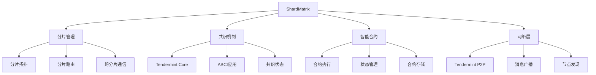

# ShardMatrix 架构设计

## 系统概述

ShardMatrix是一个基于分片技术的区块链系统，采用树形分片拓扑结构和Tendermint共识机制，支持智能合约。

## 系统架构

## 核心模块

### 1. 分片管理 (internal/shard)
- 分片拓扑：树形结构，支持动态扩展
- 分片路由：负责交易和消息的路由转发
- 跨分片通信：处理分片间的通信和状态同步

### 2. 共识机制 (internal/consensus)
- Tendermint Core：BFT共识引擎
  - 区块提案
  - 预投票和预提交
  - 区块提交
- ABCI应用：应用状态管理
  - 交易验证
  - 状态更新
  - 查询处理
- 共识状态：维护共识相关的状态信息

### 3. 智能合约 (internal/contract)
- 合约执行：支持智能合约的部署和执行
- 状态管理：管理合约状态和账户状态
- 合约存储：持久化存储合约代码和数据

### 4. 网络层 (internal/network)
- Tendermint P2P：基于Tendermint的P2P网络
  - 节点发现
  - 连接管理
  - 消息广播
- 消息广播：交易和区块的广播机制
- 节点发现：新节点的发现和连接

## 技术特点

1. 高性能
   - 分片技术提升系统吞吐量
   - Tendermint BFT共识保证快速确认
   - 并行处理提升执行效率

2. 可扩展性
   - 树形分片结构支持动态扩展
   - 模块化设计便于功能扩展
   - 支持水平扩展和垂直扩展

3. 安全性
   - 基于Tendermint的BFT共识机制
   - 分片间的安全通信
   - 智能合约的安全执行

4. 易用性
   - 完善的开发文档
   - 丰富的开发工具
   - 友好的开发接口 