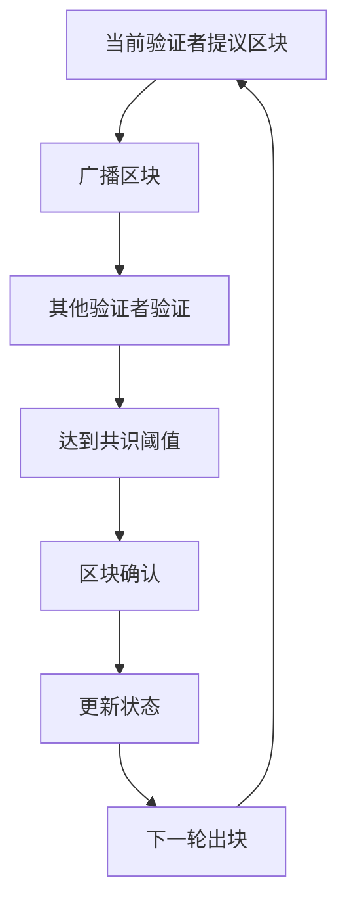
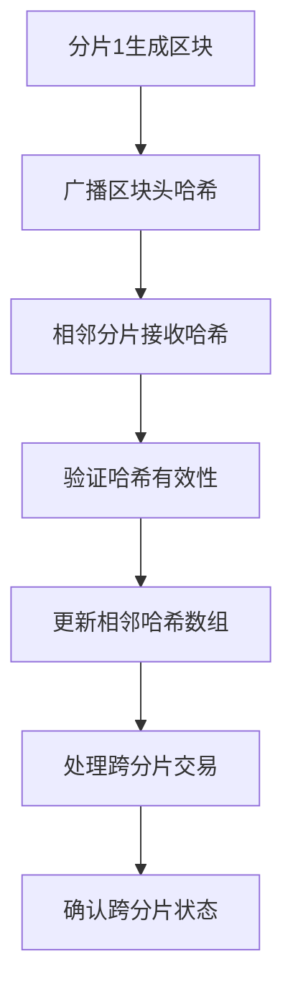

# ShardMatrix 共识机制设计

## 概述

ShardMatrix 采用委托权益证明（DPoS）共识机制，**确保固定2秒出块时间**。按阶段实现共识机制：

- 第一阶段：实现单分片DPoS共识机制
- 第二阶段：在单分片基础上优化共识机制
- 第三阶段：实现多分片共识协调机制

## 核心设计原则

### 固定出块时间
- **出块间隔**: 严格2秒
- **时间同步**: 基于NTP时间同步
- **时间容错**: ±100ms时间偏差容忍
- **出块惩罚**: 超时出块将被惩罚

### 验证者管理
```go
type Validator struct {
    Address         Address         // 验证者地址
    Stake           uint64          // 质押数量
    Status          ValidatorStatus // 验证者状态
    LastBlock       uint64          // 最后出块高度
    TotalVotes      uint64          // 总投票数
}

type ValidatorStatus int
const (
    ValidatorActive ValidatorStatus = iota
    ValidatorInactive
    ValidatorJailed
)
```

### 验证者选择（DPoS）
- 基于投票权重排序选择
- 最小质押要求：10,000 代币
- 最大验证者数量：21个（单分片）/ 每分片21个（多分片）
- 选择算法：按投票权重排序，选择前21名
- **固定出块时间：2秒**
- **轮流出块顺序**：按验证者排名顺序轮流出块

### DPoS投票机制
```go
type Delegator struct {
    Address     Address   // 委托人地址
    Validator   Address   // 委托的验证者地址
    Stake       uint64    // 委托数量
}

type VotingPower struct {
    ValidatorAddress Address
    TotalVotes       uint64
    Delegators       []Delegator
}

func CalculateVotingPower(validator *Validator, delegators []Delegator) uint64 {
    totalVotes := validator.Stake // 验证者自己的质押
    
    for _, delegator := range delegators {
        if delegator.Validator == validator.Address {
            totalVotes += delegator.Stake
        }
    }
    
    return totalVotes
}

func SelectTopValidators(candidates []Validator, maxCount int) []Validator {
    // 按投票权重排序
    sort.Slice(candidates, func(i, j int) bool {
        return candidates[i].TotalVotes > candidates[j].TotalVotes
    })
    
    // 选择前21名
    if len(candidates) > maxCount {
        return candidates[:maxCount]
    }
    return candidates
}
```

## 第一阶段共识流程（单分片）

### 共识状态
```go
type ConsensusState int
const (
    StatePropose ConsensusState = iota
    StateConfirm
)

type ConsensusRound struct {
    Height          uint64
    Proposer        Address
    Block           *Block
    Confirmed       bool
}
```

### 共识步骤流程图


### 共识步骤
1. **出块阶段**：当前验证者在2秒内提议新区块
2. **验证阶段**：其他验证者验证区块有效性
3. **确认阶段**：达到2/3+1验证者同意后确认区块
4. **状态更新**：更新全局状态，准备下一轮

### 确认条件
- **区块确认**：需要2/3+1验证者签名同意
- **固定出块时间：2秒**
- **验证者轮流**：按排名顺序轮流出块

### 时间控制机制
```go
type TimeController struct {
    blockInterval     time.Duration // 2秒
    timeTolerance     time.Duration // 100ms
    lastBlockTime     time.Time
    nextBlockTime     time.Time
}

func (tc *TimeController) ShouldProposeBlock() bool {
    now := time.Now()
    return now.After(tc.nextBlockTime) && 
           now.Sub(tc.nextBlockTime) <= tc.timeTolerance
}

func (tc *TimeController) IsBlockTimeValid(blockTime time.Time) bool {
    expectedTime := tc.lastBlockTime.Add(tc.blockInterval)
    diff := blockTime.Sub(expectedTime)
    return diff.Abs() <= tc.timeTolerance
}

func (tc *TimeController) UpdateBlockTime(blockTime time.Time) {
    tc.lastBlockTime = blockTime
    tc.nextBlockTime = blockTime.Add(tc.blockInterval)
}
```

## 第二阶段共识优化（智能合约支持）

### Gas机制集成
- **Gas计费**：合约执行按指令计费
- **Gas限制**：防止无限循环和资源耗尽
- **Gas价格**：动态调整Gas价格

### 合约状态共识
- **状态验证**：验证合约状态变更的正确性
- **状态同步**：确保所有节点合约状态一致
- **回滚机制**：合约执行失败时的状态回滚

## 第三阶段共识机制（多分片）

### 多分片共识协调
```go
type ShardConsensus struct {
    ShardID           uint64
    LocalConsensus    *ConsensusEngine
    ShardCoordinator  *ShardCoordinator
}

type ShardCoordinator struct {
    ShardMap          map[uint64]*ShardInfo
    CrossShardTxs     []*CrossShardTransaction
}
```

### 跨分片共识流程


### 跨分片交易确认
1. **交易提交**：源分片验证并记录跨分片交易
2. **哈希同步**：源分片广播区块头哈希
3. **交易处理**：目标分片获取并执行跨分片交易
4. **状态确认**：目标分片确认交易结果
5. **最终确认**：源分片更新交易状态

### 分片间协调机制
- **区块头哈希同步**：定期同步相邻分片区块头哈希
- **状态一致性验证**：通过哈希验证分片状态一致性
- **跨分片交易原子性**：确保跨分片交易要么都成功，要么都失败

## 共识引擎实现

### 第一阶段主要逻辑
```go
type ConsensusEngine struct {
    timeController    *TimeController
    validators        []Validator
    currentHeight     uint64
    currentProposer   Address
}

func (ce *ConsensusEngine) ProcessBlock(block *Block) error {
    // 1. 验证提议者
    if block.Header.Validator != ce.currentProposer {
        return errors.New("invalid proposer")
    }
    
    // 2. 验证区块时间
    if !ce.timeController.IsBlockTimeValid(time.Unix(block.Header.Timestamp, 0)) {
        return errors.New("invalid block time")
    }
    
    // 3. 验证区块内容
    if err := ce.validateBlock(block); err != nil {
        return err
    }
    
    // 4. 收集验证者签名
    if ce.hasConsensus(block) {
        ce.commitBlock(block)
        ce.updateState()
    }
    
    return nil
}

func (ce *ConsensusEngine) hasConsensus(block *Block) bool {
    requiredVotes := (len(ce.validators) * 2 / 3) + 1
    return ce.getVoteCount(block) >= requiredVotes
}

func (ce *ConsensusEngine) updateState() {
    ce.currentHeight++
    ce.currentProposer = ce.getNextProposer()
    ce.timeController.UpdateBlockTime(time.Now())
}
```

### 第三阶段多分片协调逻辑
```go
type MultiShardConsensus struct {
    shardID           uint64
    localConsensus    *ConsensusEngine
    shardCoordinator  *ShardCoordinator
    adjacentShards    [3]*RemoteShard // [父分片, 左子分片, 右子分片]
}

func (msc *MultiShardConsensus) ProcessBlock(block *Block) error {
    // 1. 执行本地共识
    if err := msc.localConsensus.ProcessBlock(block); err != nil {
        return err
    }
    
    // 2. 更新相邻分片哈希
    msc.updateAdjacentHashes(block)
    
    // 3. 处理跨分片交易
    if err := msc.processCrossShardTransactions(block); err != nil {
        return err
    }
    
    // 4. 广播区块头哈希
    msc.broadcastBlockHeaderHash(block)
    
    return nil
}

func (msc *MultiShardConsensus) updateAdjacentHashes(block *Block) {
    // 从相邻分片获取最新的区块头哈希
    for i, shard := range msc.adjacentShards {
        if shard != nil {
            hash := shard.GetLatestBlockHash()
            block.Header.AdjacentHashes[i] = hash
        }
    }
}

func (msc *MultiShardConsensus) processCrossShardTransactions(block *Block) error {
    // 处理本分片需要执行的跨分片交易
    for _, tx := range msc.getCrossShardTransactionsForShard(msc.shardID) {
        if err := msc.executeCrossShardTransaction(tx); err != nil {
            // 记录失败状态，不回滚
            msc.markCrossShardTransactionFailed(tx, err)
        } else {
            msc.markCrossShardTransactionProcessed(tx)
        }
    }
    return nil
}
```

## 安全机制

### 第一阶段安全检查
- 验证者签名验证
- 区块时间有效性检查
- 区块内容一致性验证

### 第二阶段合约安全
- 合约代码沙箱执行
- Gas限制防止资源耗尽
- 合约调用权限控制
- 合约状态访问控制

### 第三阶段分片安全
- 分片间通过区块头哈希验证
- 跨分片交易的原子性保证
- 分片状态一致性验证
- 恶意分片检测和隔离

## 奖励机制

### 第一阶段奖励分配
- 区块奖励：每个区块固定奖励
- 手续费：按比例分配给验证者
- 委托奖励：按委托比例分配

### 第二阶段合约奖励
- 合约执行手续费分配
- 合约部署费用分配

### 第三阶段分片奖励
- 分片间协调奖励
- 跨分片交易手续费分配

## 惩罚机制

### 第一阶段惩罚机制
- 离线：暂时移除验证者身份
- 恶意行为：冻结部分质押
- 重复错误：永久移除验证者身份

### 第二阶段合约惩罚
- 合约执行超时惩罚
- 合约安全漏洞惩罚

### 第三阶段分片惩罚
- 分片不同步惩罚
- 跨分片交易失败惩罚
- 恶意分片隔离

## 性能优化

### 第一阶段基础优化
- 验证者信息缓存
- 投票结果缓存
- 区块头缓存

### 第二阶段合约优化
- 合约代码缓存
- 合约状态缓存
- Gas计算优化

### 第三阶段分片优化
- 分片间通信优化
- 跨分片交易批处理
- 区块头哈希压缩传输

---

**注意**: 这是 ShardMatrix 按阶段实现的共识设计。各阶段将根据实际需求逐步完善共识机制。