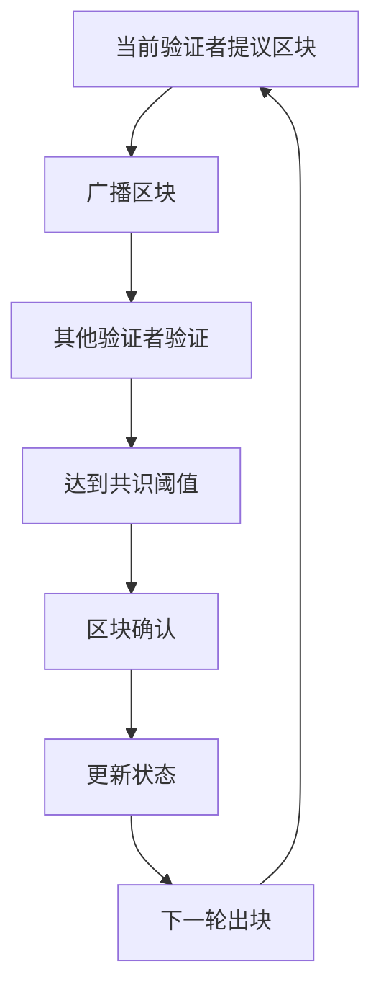

# ShardMatrix 共识机制设计

## 概述

ShardMatrix 采用委托权益证明（DPoS）共识机制，**确保固定3秒出块时间**。第一阶段专注于实现简化、稳定的基础共识机制。

## 核心设计原则

### 固定出块时间
- **出块间隔**: 严格3秒
- **时间同步**: 基于NTP时间同步
- **时间容错**: ±100ms时间偏差容忍
- **出块惩罚**: 超时出块将被惩罚

### 验证者管理
```go
type Validator struct {
    Address         Address         // 验证者地址
    Stake           uint64          // 质押数量
    Status          ValidatorStatus // 验证者状态
    LastBlock       uint64          // 最后出块高度
    TotalVotes      uint64          // 总投票数
}

type ValidatorStatus int
const (
    ValidatorActive ValidatorStatus = iota
    ValidatorInactive
    ValidatorJailed
)
```

### 验证者选择（DPoS）
- 基于投票权重排序选择
- 最小质押要求：10,000 代币
- 最大验证者数量：21个
- 选择算法：按投票权重排序，选择前21名
- **固定出块时间：3秒**
- **轮流出块顺序**：按验证者排名顺序轮流出块

### DPoS投票机制（简化版）
```go
type Delegator struct {
    Address     Address   // 委托人地址
    Validator   Address   // 委托的验证者地址
    Stake       uint64    // 委托数量
}

type VotingPower struct {
    ValidatorAddress Address
    TotalVotes       uint64
    Delegators       []Delegator
}

func CalculateVotingPower(validator *Validator, delegators []Delegator) uint64 {
    totalVotes := validator.Stake // 验证者自己的质押
    
    for _, delegator := range delegators {
        if delegator.Validator == validator.Address {
            totalVotes += delegator.Stake
        }
    }
    
    return totalVotes
}

func SelectTopValidators(candidates []Validator, maxCount int) []Validator {
    // 按投票权重排序
    sort.Slice(candidates, func(i, j int) bool {
        return candidates[i].TotalVotes > candidates[j].TotalVotes
    })
    
    // 选择前21名
    if len(candidates) > maxCount {
        return candidates[:maxCount]
    }
    return candidates
}
```

## 简化共识流程

### 共识状态
```go
type ConsensusState int
const (
    StatePropose ConsensusState = iota
    StateConfirm
)

type ConsensusRound struct {
    Height          uint64
    Proposer        Address
    Block           *Block
    Confirmed       bool
}
```

### 共识步骤流程图


### 共识步骤（第一阶段）
1. **出块阶段**：当前验证者在3秒内提议新区块
2. **验证阶段**：其他验证者验证区块有效性
3. **确认阶段**：达到2/3+1验证者同意后确认区块
4. **状态更新**：更新全局状态，准备下一轮

### 确认条件（第一阶段）
- **区块确认**：需要2/3+1验证者签名同意
- **固定出块时间：3秒**
- **验证者轮流**：按排名顺序轮流出块

### 时间控制机制（简化版）
```go
type TimeController struct {
    blockInterval     time.Duration // 3秒
    timeTolerance     time.Duration // 100ms
    lastBlockTime     time.Time
    nextBlockTime     time.Time
}

func (tc *TimeController) ShouldProposeBlock() bool {
    now := time.Now()
    return now.After(tc.nextBlockTime) && 
           now.Sub(tc.nextBlockTime) <= tc.timeTolerance
}

func (tc *TimeController) IsBlockTimeValid(blockTime time.Time) bool {
    expectedTime := tc.lastBlockTime.Add(tc.blockInterval)
    diff := blockTime.Sub(expectedTime)
    return diff.Abs() <= tc.timeTolerance
}

func (tc *TimeController) UpdateBlockTime(blockTime time.Time) {
    tc.lastBlockTime = blockTime
    tc.nextBlockTime = blockTime.Add(tc.blockInterval)
}
```

## 共识引擎（第一阶段）

### 主要逻辑
```go
type ConsensusEngine struct {
    timeController    *TimeController
    validators        []Validator
    currentHeight     uint64
    currentProposer   Address
}

func (ce *ConsensusEngine) ProcessBlock(block *Block) error {
    // 1. 验证提议者
    if block.Header.Validator != ce.currentProposer {
        return errors.New("invalid proposer")
    }
    
    // 2. 验证区块时间
    if !ce.timeController.IsBlockTimeValid(time.Unix(block.Header.Timestamp, 0)) {
        return errors.New("invalid block time")
    }
    
    // 3. 验证区块内容
    if err := ce.validateBlock(block); err != nil {
        return err
    }
    
    // 4. 收集验证者签名
    if ce.hasConsensus(block) {
        ce.commitBlock(block)
        ce.updateState()
    }
    
    return nil
}

func (ce *ConsensusEngine) hasConsensus(block *Block) bool {
    requiredVotes := (len(ce.validators) * 2 / 3) + 1
    return ce.getVoteCount(block) >= requiredVotes
}

func (ce *ConsensusEngine) updateState() {
    ce.currentHeight++
    ce.currentProposer = ce.getNextProposer()
    ce.timeController.UpdateBlockTime(time.Now())
}
```

## 安全机制（第一阶段）

### 基础安全检查
- 验证者签名验证
- 区块时间有效性检查
- 区块内容一致性验证

### 简化惩罚机制
- 离线检测：监控验证者出块情况
- 超时惩罚：错过出块时间的验证者被标记
- 自动替换：离线验证者自动被替换

## 奖励机制（第一阶段）

### 简化奖励分配
- 区块奖励：每个区块固定奖励
- 手续费：按比例分配给验证者
- 委托奖励：按委托比例分配

### 简化惩罚机制
- 离线：暂时移除验证者身份
- 恶意行为：冻结部分质押
- 重复错误：永久移除验证者身份

## 性能优化（第一阶段）

### 基础优化
- 验证者信息缓存
- 投票结果缓存
- 区块头缓存

### 简化并行处理
- 基础消息并行处理
- 简化的状态更新

---

**注意**: 这是 ShardMatrix 第一阶段的简化共识设计。后续阶段将根据实际需求添加更高级的特性，如快速确认、最终确认等机制。
