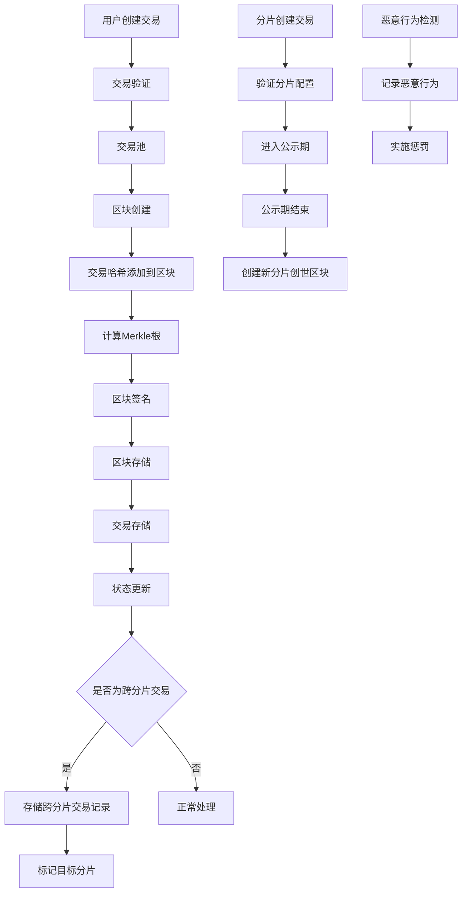

# ShardMatrix 数据结构设计

## 概述

本文档详细描述了 ShardMatrix 分片区块链平台的核心数据结构设计，包括区块、交易、存储等关键组件。

**注意**: 第一阶段专注于基础功能实现，数据结构设计尽量简化以确保稳定性。

## 基础类型定义

### Hash 哈希类型
```go
type Hash [32]byte // 32字节哈希值

// Hash 方法
func (h Hash) String() string {
    return hex.EncodeToString(h[:])
}

func (h Hash) Bytes() []byte {
    return h[:]
}

func (h Hash) IsZero() bool {
    return h == Hash{}
}

// 创建Hash
func NewHash(data []byte) Hash {
    var h Hash
    copy(h[:], data)
    return h
}

// 从字符串创建Hash
func HashFromString(s string) (Hash, error) {
    data, err := hex.DecodeString(s)
    if err != nil {
        return Hash{}, err
    }
    if len(data) != 32 {
        return Hash{}, errors.New("invalid hash length")
    }
    return NewHash(data), nil
}
```

### Address 地址类型
```go
type Address [20]byte // 20字节地址

// Address 方法
func (a Address) String() string {
    return hex.EncodeToString(a[:])
}

func (a Address) Bytes() []byte {
    return a[:]
}

func (a Address) IsZero() bool {
    return a == Address{}
}

// 创建Address
func NewAddress(data []byte) Address {
    var addr Address
    copy(addr[:], data)
    return addr
}

// 从公钥创建Address
func AddressFromPublicKey(pubKey []byte) Address {
    hash := sha256.Sum256(pubKey)
    var addr Address
    copy(addr[:], hash[:20])
    return addr
}

// 从字符串创建Address
func AddressFromString(s string) (Address, error) {
    data, err := hex.DecodeString(s)
    if err != nil {
        return Address{}, err
    }
    if len(data) != 20 {
        return Address{}, errors.New("invalid address length")
    }
    return NewAddress(data), nil
}
```

## 创世区块配置

### GenesisConfig 创世配置
```go
type GenesisConfig struct {
    ShardID           uint64      `json:"shard_id"`           // 分片ID
    Timestamp         int64       `json:"timestamp"`          // 创世时间戳（第一个分片基于配置，其他分片基于公示期结束时间）
    InitialValidators []Validator `json:"initial_validators"` // 初始验证者列表
    InitialAccounts   []Account   `json:"initial_accounts"`   // 初始账户
    BlockInterval     uint64      `json:"block_interval"`     // 区块间隔（秒）
    MaxBlockSize      uint64      `json:"max_block_size"`     // 最大区块大小（字节）
}

// 创世区块
type GenesisBlock struct {
    Header       *BlockHeader `json:"header"`
    Transactions []Hash       `json:"transactions"` // 创世交易哈希列表
}
```

### ShardCreationTransaction 分片创建交易
```go
type ShardCreationTransaction struct {
    Creator       Address       `json:"creator"`        // 创建者地址
    NewShardID    uint64        `json:"new_shard_id"`   // 新分片ID
    Config        GenesisConfig `json:"config"`         // 新分片配置
    Deposit       uint64        `json:"deposit"`        // 创建押金
    Nonce         uint64        `json:"nonce"`          // 防重放攻击
    Signature     []byte        `json:"signature"`      // 签名
}

// 分片创建状态
type ShardCreationStatus string

const (
    ShardCreationPending   ShardCreationStatus = "pending"     // 等待确认
    ShardCreationApproved  ShardCreationStatus = "approved"    // 已批准
    ShardCreationActive    ShardCreationStatus = "active"      // 已激活
)
```

## 区块结构

### BlockHeader 区块头

```go
type BlockHeader struct {
    Number         uint64      // 区块序号
    Timestamp      int64       // 时间戳
    PrevHash       Hash        // 前一个区块哈希
    TxRoot         Hash        // 交易Merkle根
    StateRoot      Hash        // 状态Merkle根
    Validator      Address     // 验证者地址
    Signature      []byte      // 验证者签名（创世区块为空）
    ShardID        uint64      // 当前分片ID
    AdjacentHashes [3]Hash     // 相邻分片的区块头哈希数组[父分片, 左子分片, 右子分片]
}
```

**字段说明**:
- `Number`: 区块高度，从0开始递增
- `Timestamp`: 区块创建时间戳（Unix时间戳）
- `PrevHash`: 前一个区块的哈希值，形成链式结构
- `TxRoot`: 交易Merkle根，用于验证交易完整性
- `StateRoot`: 状态Merkle根，用于验证状态完整性
- `Validator`: 创建该区块的验证者地址
- `Signature`: 验证者对区块的签名（创世区块为空）
- `ShardID`: 当前分片的ID
- `AdjacentHashes`: 相邻分片的区块头哈希数组，用于分片间链接

### Block 区块

```go
type Block struct {
    Header       *BlockHeader `json:"header"`
    Transactions []Hash       `json:"transactions"` // 交易哈希列表
}
```

**设计原则**:
- 区块只包含交易哈希，不包含完整交易数据
- 这样可以减少区块大小，提高网络传输效率
- 完整交易数据存储在交易池或数据库中
- 符合区块链的设计模式

## 交易结构

### Transaction 交易

```go
type Transaction struct {
    ShardID   uint64  `json:"shard_id"`  // 分片ID
    From      Address `json:"from"`      // 发送方地址
    To        Address `json:"to"`        // 接收方地址
    Amount    uint64  `json:"amount"`    // 转账金额
    GasPrice  uint64  `json:"gas_price"` // Gas价格
    GasLimit  uint64  `json:"gas_limit"` // Gas限制
    Nonce     uint64  `json:"nonce"`     // 防止重放攻击
    Data      []byte  `json:"data"`      // 交易数据
    Signature []byte  `json:"signature"` // 签名
}
```

**字段说明**:
- `From`: 交易发送方地址
- `To`: 交易接收方地址
- `Amount`: 转账金额（基础货币单位）
- `GasPrice`: Gas价格，用于计算交易费用
- `GasLimit`: Gas限制，交易愿意消耗的最大Gas数量
- `Nonce`: 发送方的交易序号，防止重放攻击
- `Data`: 交易数据（可以是转账金额等）
- `Signature`: 发送方对交易的数字签名
- `ShardID`: 交易所属的分片ID

**设计特点**:
- 简化的交易模型，易于理解和实现
- 支持多种交易类型（通过Data字段扩展）
- 包含基本的验证机制
- 第一阶段主要支持基础转账功能
- 添加了分片ID字段，用于标识交易所属的分片
- 使用Gas机制替代固定费用，提供更灵活的费用模型

### CrossShardTransaction 跨分片交易

```go
// 跨分片交易预编译地址
const (
    CrossShardPrecompileAddress = "0x0000000000000000000000000000000000000001"
)

type CrossShardTransaction struct {
    TxHash        Hash    `json:"tx_hash"`        // 原始交易哈希
    Transaction   *Transaction `json:"transaction"`   // 原始交易
    SourceShardID uint64  `json:"source_shard_id"` // 源分片ID
    TargetShardID uint64  `json:"target_shard_id"` // 目标分片ID
    Status        string  `json:"status"`         // 处理状态 (pending, processed, failed)
    CreatedAt     int64   `json:"created_at"`     // 创建时间
    ProcessedAt   int64   `json:"processed_at"`   // 处理时间
}

type CrossShardTransactionStatus string

const (
    CrossShardTxPending   CrossShardTransactionStatus = "pending"
    CrossShardTxProcessed CrossShardTransactionStatus = "processed"
    CrossShardTxFailed    CrossShardTransactionStatus = "failed"
)
```

**设计说明**:
- 跨分片交易通过特定的预编译地址标识（To字段为`CrossShardPrecompileAddress`）
- 源分片处理跨分片交易时，将交易记录存储到存储层
- 目标分片定期检查存储层中的跨分片交易记录并处理
- 通过状态字段跟踪跨分片交易的处理进度

### Account 账户结构

```go
type Account struct {
    Address   Address `json:"address"`   // 账户地址
    Balance   uint64  `json:"balance"`   // 账户余额
    Nonce     uint64  `json:"nonce"`     // 交易计数器
    UpdatedAt int64   `json:"updated_at"` // 最后更新时间
}
```

### Validator 验证者结构

```go
type Validator struct {
    Address    Address         `json:"address"`    // 验证者地址
    Stake      uint64          `json:"stake"`      // 质押数量
    Status     ValidatorStatus `json:"status"`     // 验证者状态
    LastBlock  uint64          `json:"last_block"` // 最后出块高度
    TotalVotes uint64          `json:"total_votes"`// 总投票数
}

type ValidatorStatus int
const (
    ValidatorActive ValidatorStatus = iota
    ValidatorInactive
    ValidatorJailed
)

type Delegator struct {
    Address   Address `json:"address"`   // 委托人地址
    Validator Address `json:"validator"` // 委托的验证者地址
    Stake     uint64  `json:"stake"`     // 委托数量
}
```

## 存储设计

### 存储接口定义

```go
// 区块存储接口
type BlockStore interface {
    PutBlock(block *Block) error
    GetBlock(blockHash []byte) (*Block, error)
    GetBlockByHeight(height uint64) (*Block, error)
    HasBlock(blockHash []byte) bool
    GetLatestBlock() (*Block, error)
    PutGenesisBlock(block *GenesisBlock) error
    GetGenesisBlock() (*GenesisBlock, error)
}

// 交易存储接口
type TransactionStore interface {
    PutTransaction(tx *Transaction) error
    GetTransaction(txHash []byte) (*Transaction, error)
    HasTransaction(txHash []byte) bool
    DeleteTransaction(txHash []byte) error
    GetTransactionsByBlock(blockHash []byte) ([]*Transaction, error)
    PutShardCreationTransaction(tx *ShardCreationTransaction) error
    GetShardCreationTransaction(txHash []byte) (*ShardCreationTransaction, error)
}

// 跨分片交易存储接口
type CrossShardTransactionStore interface {
    PutCrossShardTransaction(tx *CrossShardTransaction) error
    GetCrossShardTransaction(txHash []byte) (*CrossShardTransaction, error)
    GetCrossShardTransactionsByTargetShard(shardID uint64) ([]*CrossShardTransaction, error)
    UpdateCrossShardTransactionStatus(txHash Hash, status CrossShardTransactionStatus) error
    DeleteCrossShardTransaction(txHash []byte) error
}

// 账户状态存储接口
type StateStore interface {
    GetAccount(address Address) (*Account, error)
    UpdateAccount(address Address, account *Account) error
    DeleteAccount(address Address) error
    GetStateRoot() Hash
    Commit() error
    Rollback() error
}

// 验证者存储接口
type ValidatorStore interface {
    GetValidator(address Address) (*Validator, error)
    UpdateValidator(validator *Validator) error
    GetAllValidators() ([]*Validator, error)
    GetActiveValidators() ([]*Validator, error)
    GetDelegators(validator Address) ([]*Delegator, error)
    UpdateDelegator(delegator *Delegator) error
}

// 恶意行为存储接口
type MaliciousBehaviorStore interface {
    PutMaliciousBehavior(behavior *MaliciousBehavior) error
    GetMaliciousBehaviorsByValidator(address Address) ([]*MaliciousBehavior, error)
    GetMaliciousBehaviorsByType(behaviorType string) ([]*MaliciousBehavior, error)
}

// 恶意行为记录
type MaliciousBehavior struct {
    Validator     Address  `json:"validator"`      // 恶意验证者地址
    BehaviorType  string   `json:"behavior_type"`  // 恶意行为类型
    BlockHeight   uint64   `json:"block_height"`   // 区块高度
    Timestamp     int64    `json:"timestamp"`      // 时间戳
    Evidence      []byte   `json:"evidence"`       // 证据数据
    Penalty       uint64   `json:"penalty"`        // 惩罚金额
}

// 惩罚类型
type PenaltyType string

const (
    PenaltyDuplicateBlock    PenaltyType = "duplicate_block"     // 重复区块
    PenaltyInvalidSignature  PenaltyType = "invalid_signature"   // 无效签名
    PenaltyDoubleSign        PenaltyType = "double_sign"         // 双重签名
)
```

### 存储格式

**LevelDB 键值格式**:
```
// 区块存储
Key: "block:{区块哈希}"
Value: 序列化的区块数据

Key: "block_height:{高度}"
Value: 区块哈希

Key: "genesis_block"
Value: 序列化的创世区块数据

// 交易存储
Key: "tx:{交易哈希}"
Value: 序列化的交易数据

Key: "shard_creation_tx:{交易哈希}"
Value: 序列化的分片创建交易数据

// 跨分片交易存储
Key: "cross_shard_tx:{交易哈希}"
Value: 序列化的跨分片交易数据

Key: "cross_shard_tx_target:{目标分片ID}:{交易哈希}"
Value: 交易哈希（用于按目标分片查询）

// 账户状态
Key: "account:{地址}"
Value: 序列化的账户数据

// 验证者信息
Key: "validator:{地址}"
Value: 序列化的验证者数据

Key: "delegator:{委托人地址}:{验证者地址}"
Value: 序列化的委托信息

// 恶意行为记录
Key: "malicious:{验证者地址}:{时间戳}"
Value: 序列化的恶意行为数据

Key: "malicious_type:{行为类型}:{时间戳}"
Value: 序列化的恶意行为数据
```

## 数据流程（第一阶段）



## 设计原则（第一阶段）
- **简单优先**: 优先选择简单可靠的实现方案
- **类型安全**: 使用强类型和枚举
- **模块化**: 保持良好的模块边界，便于后续扩展
- **可测试**: 所有核心功能必须有完整测试

## 性能与扩展性（第一阶段）
- **基础优化**: 缓存、批量处理
- **后续扩展**: 跨链支持
- **向后兼容**: 数据结构版本控制