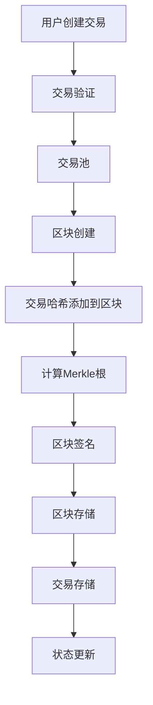

# ShardMatrix 数据结构设计

## 概述

本文档详细描述了 ShardMatrix 单链区块链平台的核心数据结构设计，包括区块、交易、存储等关键组件。

**注意**: 第一阶段专注于基础功能实现，数据结构设计尽量简化以确保稳定性。

## 基础类型定义

### Hash 哈希类型
```go
type Hash [32]byte // 32字节哈希值

// Hash 方法
func (h Hash) String() string {
    return hex.EncodeToString(h[:])
}

func (h Hash) Bytes() []byte {
    return h[:]
}

func (h Hash) IsZero() bool {
    return h == Hash{}
}

// 创建Hash
func NewHash(data []byte) Hash {
    var h Hash
    copy(h[:], data)
    return h
}

// 从字符串创建Hash
func HashFromString(s string) (Hash, error) {
    data, err := hex.DecodeString(s)
    if err != nil {
        return Hash{}, err
    }
    if len(data) != 32 {
        return Hash{}, errors.New("invalid hash length")
    }
    return NewHash(data), nil
}
```

### Address 地址类型
```go
type Address [20]byte // 20字节地址

// Address 方法
func (a Address) String() string {
    return hex.EncodeToString(a[:])
}

func (a Address) Bytes() []byte {
    return a[:]
}

func (a Address) IsZero() bool {
    return a == Address{}
}

// 创建Address
func NewAddress(data []byte) Address {
    var addr Address
    copy(addr[:], data)
    return addr
}

// 从公钥创建Address
func AddressFromPublicKey(pubKey []byte) Address {
    hash := sha256.Sum256(pubKey)
    var addr Address
    copy(addr[:], hash[:20])
    return addr
}

// 从字符串创建Address
func AddressFromString(s string) (Address, error) {
    data, err := hex.DecodeString(s)
    if err != nil {
        return Address{}, err
    }
    if len(data) != 20 {
        return Address{}, errors.New("invalid address length")
    }
    return NewAddress(data), nil
}
```

## 区块结构

### BlockHeader 区块头

```go
type BlockHeader struct {
    Number      uint64    // 区块序号
    Timestamp   int64     // 时间戳
    PrevHash    Hash      // 前一个区块哈希
    TxRoot      Hash      // 交易RootHash
    StateRoot   Hash      // 状态RootHash
    Validator   Address   // 验证者地址
    Signature   []byte    // 验证者签名
}
```

**字段说明**:
- `Number`: 区块高度，从0开始递增
- `Timestamp`: 区块创建时间戳（Unix时间戳）
- `PrevHash`: 前一个区块的哈希值，形成链式结构
- `TxRoot`: 交易Merkle根，用于验证交易完整性
- `StateRoot`: 状态Merkle根，用于验证状态完整性
- `Validator`: 创建该区块的验证者地址
- `Signature`: 验证者对区块的签名

### Block 区块

```go
type Block struct {
    Header       *BlockHeader `json:"header"`
    Transactions []Hash       `json:"transactions"` // 交易哈希列表
}
```

**设计原则**:
- 区块只包含交易哈希，不包含完整交易数据
- 这样可以减少区块大小，提高网络传输效率
- 完整交易数据存储在交易池或数据库中
- 符合区块链的设计模式

## 交易结构

### Transaction 交易

```go
type Transaction struct {
    From      Address `json:"from"`      // 发送方地址
    To        Address `json:"to"`        // 接收方地址
    Amount    uint64  `json:"amount"`    // 转账金额
    Fee       uint64  `json:"fee"`       // 手续费
    Nonce     uint64  `json:"nonce"`     // 防止重放攻击
    Data      []byte  `json:"data"`      // 交易数据
    Signature []byte  `json:"signature"` // 签名
}
```

**字段说明**:
- `From`: 交易发送方地址
- `To`: 交易接收方地址
- `Amount`: 转账金额（基础货币单位）
- `Fee`: 交易手续费
- `Nonce`: 发送方的交易序号，防止重放攻击
- `Data`: 交易数据（可以是转账金额、智能合约调用等）
- `Signature`: 发送方对交易的数字签名

**设计特点**:
- 简化的交易模型，易于理解和实现
- 支持多种交易类型（通过Data字段扩展）
- 包含基本的验证机制
- 第一阶段主要支持基础转账功能

### Account 账户结构

```go
type Account struct {
    Address   Address `json:"address"`   // 账户地址
    Balance   uint64  `json:"balance"`   // 账户余额
    Nonce     uint64  `json:"nonce"`     // 交易计数器
    UpdatedAt int64   `json:"updated_at"` // 最后更新时间
}
```

### Validator 验证者结构

```go
type Validator struct {
    Address    Address         `json:"address"`    // 验证者地址
    Stake      uint64          `json:"stake"`      // 质押数量
    Status     ValidatorStatus `json:"status"`     // 验证者状态
    LastBlock  uint64          `json:"last_block"` // 最后出块高度
    TotalVotes uint64          `json:"total_votes"`// 总投票数
}

type ValidatorStatus int
const (
    ValidatorActive ValidatorStatus = iota
    ValidatorInactive
    ValidatorJailed
)

type Delegator struct {
    Address   Address `json:"address"`   // 委托人地址
    Validator Address `json:"validator"` // 委托的验证者地址
    Stake     uint64  `json:"stake"`     // 委托数量
}
```

## 存储设计

### 存储接口定义

```go
// 区块存储接口
type BlockStore interface {
    PutBlock(block *Block) error
    GetBlock(blockHash []byte) (*Block, error)
    GetBlockByHeight(height uint64) (*Block, error)
    HasBlock(blockHash []byte) bool
    GetLatestBlock() (*Block, error)
}

// 交易存储接口
type TransactionStore interface {
    PutTransaction(tx *Transaction) error
    GetTransaction(txHash []byte) (*Transaction, error)
    HasTransaction(txHash []byte) bool
    DeleteTransaction(txHash []byte) error
    GetTransactionsByBlock(blockHash []byte) ([]*Transaction, error)
}

// 账户状态存储接口
type StateStore interface {
    GetAccount(address Address) (*Account, error)
    UpdateAccount(address Address, account *Account) error
    DeleteAccount(address Address) error
    GetStateRoot() Hash
    Commit() error
    Rollback() error
}

// 验证者存储接口
type ValidatorStore interface {
    GetValidator(address Address) (*Validator, error)
    UpdateValidator(validator *Validator) error
    GetAllValidators() ([]*Validator, error)
    GetActiveValidators() ([]*Validator, error)
    GetDelegators(validator Address) ([]*Delegator, error)
    UpdateDelegator(delegator *Delegator) error
}
```

### 存储实现

```go
type LevelDBStore struct {
    db *leveldb.DB
}

// 区块存储实现
type BlockStoreImpl struct {
    db *leveldb.DB
}

func (bs *BlockStoreImpl) PutBlock(block *Block) error {
    key := append([]byte("block:"), block.Header.Hash()...)
    value, err := json.Marshal(block)
    if err != nil {
        return err
    }
    return bs.db.Put(key, value, nil)
}

func (bs *BlockStoreImpl) GetBlock(blockHash []byte) (*Block, error) {
    key := append([]byte("block:"), blockHash...)
    value, err := bs.db.Get(key, nil)
    if err != nil {
        return nil, err
    }
    
    var block Block
    err = json.Unmarshal(value, &block)
    return &block, err
}
```

### 存储格式

**LevelDB 键值格式**:
```
// 区块存储
Key: "block:{区块哈希}"
Value: 序列化的区块数据

Key: "block_height:{高度}"
Value: 区块哈希

// 交易存储
Key: "tx:{交易哈希}"
Value: 序列化的交易数据

// 账户状态
Key: "account:{地址}"
Value: 序列化的账户数据

// 验证者信息
Key: "validator:{地址}"
Value: 序列化的验证者数据

Key: "delegator:{委托人地址}:{验证者地址}"
Value: 序列化的委托信息
```

## 数据流程（第一阶段）



## Merkle树（第一阶段简化实现）

### 交易Merkle根计算
```go
func (b *Block) CalculateTxRoot() Hash {
    if len(b.Transactions) == 0 { 
        return Hash{} 
    }
    return calculateMerkleRoot(b.Transactions)
}

func calculateMerkleRoot(hashes []Hash) Hash {
    // 简化算法: 递归两两哈希
    if len(hashes) == 1 { 
        return hashes[0] 
    }
    if len(hashes)%2 == 1 { 
        hashes = append(hashes, hashes[len(hashes)-1]) 
    }
    
    nextLevel := make([]Hash, len(hashes)/2)
    for i := 0; i < len(hashes); i += 2 {
        combined := append(hashes[i][:], hashes[i+1][:]...)
        nextLevel[i/2] = NewHash(sha256.Sum256(combined)[:])
    }
    return calculateMerkleRoot(nextLevel)
}
```

## 设计原则（第一阶段）
- **简单优先**: 优先选择简单可靠的实现方案
- **类型安全**: 使用强类型和枚举
- **模块化**: 保持良好的模块边界，便于后续扩展
- **可测试**: 所有核心功能必须有完整测试

## 性能与扩展性（第一阶段）
- **基础优化**: 缓存、批量处理
- **后续扩展**: 智能合约、跨链支持
- **向后兼容**: 数据结构版本控制

## 测试策略
- 单元测试: `go test ./pkg/types/...`
- 集成测试: `go test ./pkg/storage/...`
- 性能测试: `go test -bench=. ./pkg/types/...`

---

**重要说明**: 这是 ShardMatrix 第一阶段的数据结构设计。后续阶段将根据实际需求添加更复杂的特性，如Gas机制、智能合约等.