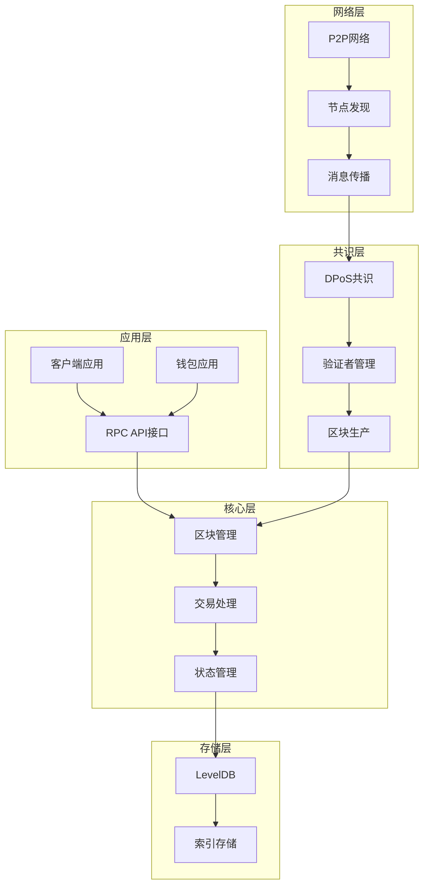
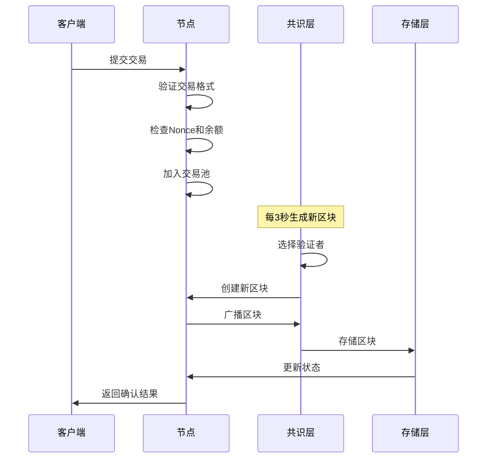
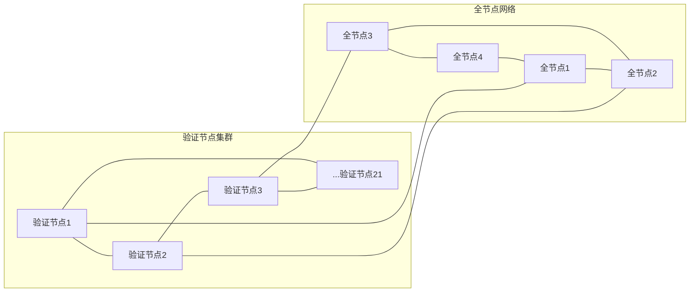

# ShardMatrix 架构概览

## 项目简介

ShardMatrix 是一个高性能的单链区块链平台，专注于可扩展性和效率。采用简化的 DPoS 共识机制，支持稳定的交易处理。

**注意**: 项目采用迭代开发策略，第一阶段专注于实现基础区块链功能，后续阶段将逐步添加高级特性。

## 核心特性

### 性能指标
- **区块间隔**: 3秒（固定）
- **区块大小**: 2MB（可调整）
- **确认时间**: 即时确认（简化版）
- **验证节点**: 21个验证节点
- **性能目标**: 第一阶段以稳定性为主，后续优化性能

### 技术栈
- **开发语言**: Go 1.21+
- **数据库**: LevelDB
- **网络库**: libp2p-go
- **序列化**: gob
- **共识算法**: DPoS（委托权益证明）
- **加密算法**: Ed25519 + SHA256

## 系统架构



## 核心组件

### 1. 区块结构
```go
type BlockHeader struct {
    Number        uint64    // 区块序号
    Timestamp     int64     // 时间戳
    PrevHash      Hash      // 前一个区块哈希
    TxRoot        Hash      // 交易Merkle根
    StateRoot     Hash      // 状态Merkle根
    Validator     Address   // 验证者地址
    Signature     []byte    // 验证者签名
}

type Block struct {
    Header        *BlockHeader `json:"header"`
    Transactions  []Hash       `json:"transactions"` // 交易哈希列表
}
```

### 2. 交易模型
```go
type Transaction struct {
    From      Address   // 发送方地址
    To        Address   // 接收方地址
    Amount    uint64    // 转账金额
    Fee       uint64    // 手续费
    Nonce     uint64    // 防止重放攻击
    Data      []byte    // 交易数据
    Signature []byte    // 签名
}
```

### 3. 委托权益证明共识机制（DPoS）
- **验证节点数量**: 21个验证节点
- **出块机制**: 基于投票权重的验证者选择 + 轮流出块
- **确认机制**: 即时确认（简化版）
- **惩罚机制**: 基础惩罚机制
- **投票管理**: 动态委托、解委托

## 数据流



## 网络拓扑



## 存储设计

### 存储结构
```
blocks/          # 区块数据
├── {height}     # 按高度存储
└── {hash}       # 按哈希存储

transactions/    # 交易数据
├── {txid}       # 按交易ID存储
└── {block}      # 按区块存储

accounts/        # 账户状态
├── {address}    # 按地址存储
└── balance_index # 余额索引

validators/      # 验证者信息
├── validators   # 验证者列表
├── stakes       # 权益信息
└── delegators   # 委托人信息

indexes/         # 索引数据
├── tx_index     # 交易索引
└── block_index  # 区块索引
```

## 安全机制

参考 [design_summary.md](./design_summary.md) 中的详细描述，包括交易安全、共识安全和网络安全。