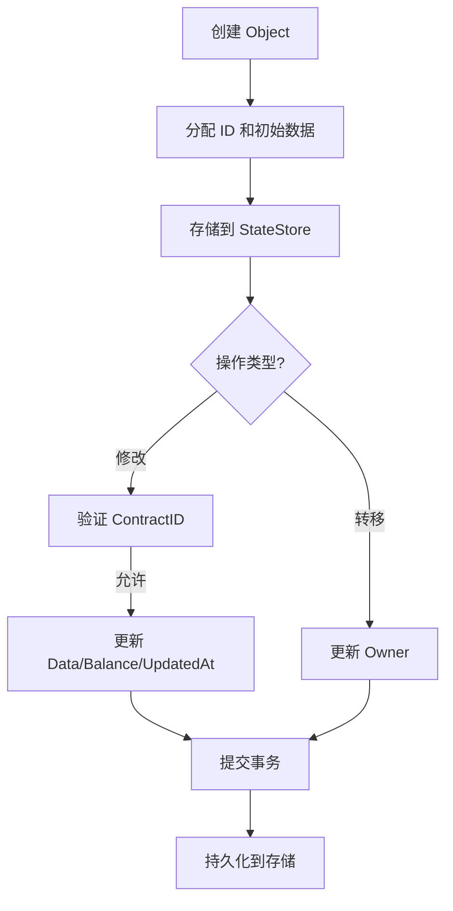

# ShardMatrix 存储层设计

## 概述

ShardMatrix 存储层采用分层存储架构，使用 LevelDB 和 RocksDB 提供高性能的数据存储。

## 存储架构

- **区块存储**：LevelDB
- **状态存储**：RocksDB
- **索引存储**：LevelDB
- **归档存储**：LevelDB
- **缓存层**：内存缓存

## 存储组件

### 存储管理器
```go
type StorageManager struct {
    blockStore      BlockStore
    txStore         TransactionStore
    stateStore      StateStore
    indexStore      IndexStore
    archiveStore    ArchiveStore
    cache           Cache
}

type BlockStore interface {
    PutBlock(block *Block) error
    GetBlock(blockHash []byte) (*Block, error)
    GetBlockByHeight(height uint64) (*Block, error)
    HasBlock(blockHash []byte) bool
    GetLatestBlock() (*Block, error)
}

type StateStore interface {
    GetAccount(address Address) (*Account, error)
    UpdateAccount(address Address, account *Account) error
    GetStateRoot() Hash
    Commit() error
    Rollback() error
}
```

## 数据存储结构

### LevelDB 表结构
```
blocks/          # 区块数据
├── {height}     # 按高度存储
└── {hash}       # 按哈希存储

transactions/    # 交易数据
├── {txid}       # 按交易ID存储
└── {block}      # 按区块存储

accounts/        # 账户状态
├── {address}    # 按地址存储
└── balance_index # 余额索引

state/           # 状态存储
├── accounts     # 账户状态
├── contracts    # 合约状态
└── storage      # 存储状态

validators/      # 验证者信息
├── validators   # 验证者列表
├── stakes       # 权益信息
├── delegators   # 委托人信息
├── votes        # 投票权重
└── punishments  # 惩罚记录

indexes/         # 索引数据
├── tx_index     # 交易索引
├── block_index  # 区块索引
└── state_index  # 状态索引

archive/         # 归档数据
├── old_blocks   # 旧区块
└── old_states   # 旧状态
```

## 索引管理

### 索引结构
```go
type IndexStore struct {
    db             *leveldb.DB
    indexes        map[string]Index
}

type Index interface {
    Name() string
    Put(key []byte, value []byte) error
    Get(key []byte) ([]byte, error)
    Delete(key []byte) error
    Range(start, end []byte) (Iterator, error)
}
```

### 索引类型
- **交易索引**：按地址索引交易
- **区块索引**：按高度索引区块
- **状态索引**：按地址索引状态

## 缓存策略

### 多级缓存
```go
type Cache struct {
    l1Cache        *lru.Cache  // 内存缓存
    l2Cache        *lru.Cache  // 磁盘缓存
    blockCache     *lru.Cache  // 区块缓存
    stateCache     *lru.Cache  // 状态缓存
}
```

### 缓存策略
- **LRU 策略**：最近最少使用
- **TTL 策略**：时间到期
- **写回策略**：延迟写入
- **预取策略**：预测性加载

## 数据压缩

### 压缩算法
- **区块压缩**：使用 LZ4 快速压缩
- **状态压缩**：使用 Zstd 高压缩比
- **索引压缩**：使用 Gzip 平衡压缩

### 压缩策略
- 数据大小阈值
- 压缩级别选择
- 压缩时间控制

## 数据归档

### 归档策略
```go
type ArchivePolicy struct {
    BlockRetention  uint64        // 区块保留高度
    StateRetention  uint64        // 状态保留高度
    ArchiveInterval time.Duration // 归档间隔
}
```

### 归档流程
1. **数据选择**：选择需要归档的数据
2. **数据压缩**：压缩归档数据
3. **数据存储**：存储到归档数据库
4. **数据清理**：清理原始数据
5. **索引更新**：更新相关索引

## 性能优化

### 批量操作
```go
type BatchWriter struct {
    batch           *leveldb.Batch
    maxBatchSize    int
    writeOptions    *leveldb.WriteOptions
}
```

### 并行处理
- 多协程并行写入
- 异步批量提交
- 并发索引更新

## 数据一致性

### 事务支持
```go
type Transaction struct {
    operations      []Operation
    db              *leveldb.DB
}
```

### 一致性检查
- 区块完整性检查
- 状态一致性检查
- 索引一致性检查

## 监控指标

### 存储指标
- 数据库大小
- 读写性能
- 缓存命中率
- 压缩比率

### 性能指标
- 查询延迟
- 写入吞吐量
- 索引性能
- 归档效率

### 健康指标
- 磁盘使用率
- 内存使用率
- 错误率
- 一致性状态

## Object 定义

在 ShardMatrix 中，存储层引入了 Object 作为基本数据单元，用于支持数据与逻辑分离的智能合约模式。每个 Object 代表一个独立的数据实体，可被智能合约管理。

### Key-Value 存储接口

```go
type KeyValueStore interface {
    Get(key string) ([]byte, error)
    Put(key string, value []byte) error
    Delete(key string) error
    Has(key string) bool
    Range(start, end string) (Iterator, error)
    Clear() error
    Size() int
}
```

### Object 结构

```go
type Object struct {
    ID           Hash          // 唯一的 Object ID (例如，使用 UUID 或哈希生成)
    ContractID   Hash          // 所属智能合约的 ID
    Owner        Address       // 当前所有者（用户地址）
    Balance      uint64        // Object 关联的余额（例如，代币）
    UpdatedAt    time.Time     // 最后更新时间
    Data         KeyValueStore // Key-Value 数据存储接口
}
```

### 关键特性

1. **数据与逻辑分离**：Object 只存储数据，智能合约逻辑在单独的模块中执行，通过调用存储 API 操作 Object。

2. **所有权与转移**：
   - Object 可直接转移给其他用户，通过更新 `Owner` 字段。
   - 转移操作需通过交易验证，确保原子性和一致性。

3. **修改规则**：
   - 只有所属的智能合约（通过 `ContractID` 验证）允许修改 Object 的 `Data` 和 `Balance`。
   - 更新时自动设置 `UpdatedAt`。

4. **存储集成**：
   - Object 存储在 StateStore 中，按 ID 索引。
   - 支持批量操作和缓存以优化性能。

5. **Key-Value 存储抽象**：
   - Object 的 Data 字段使用 KeyValueStore 接口，而非内存 map。
   - 支持不同的存储后端实现（如 LevelDB、RocksDB 等）。
   - 提供统一的 API 进行数据操作。

### Object 生命周期流程图



此设计确保了数据的安全性和灵活性，支持 ShardMatrix 的分布式存储需求。
