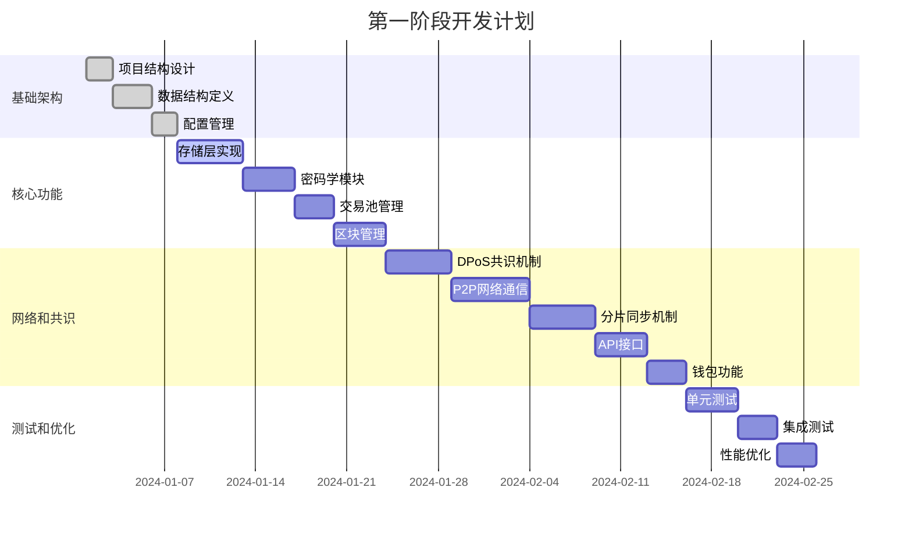
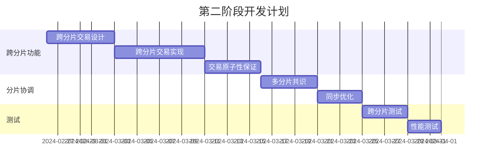

# ShardMatrix 开发路线图

## 项目概述

ShardMatrix 是一个高性能的分片区块链平台，采用分阶段开发策略，逐步实现从基础功能到高级特性的完整区块链系统。

## 开发阶段

### 第一阶段：基础区块链功能和分片机制（当前阶段）

**目标**: 实现区块链的基本功能，包括区块创建、交易处理、DPoS共识机制和创新分片机制。

**时间估算**: 6-8周

#### 核心功能
- [x] 项目架构设计
- [x] 基础数据结构定义（区块、交易、分片）
- [x] 配置管理系统
- [ ] 存储层实现（LevelDB，支持分片）
- [ ] 密码学模块（密钥生成、签名验证）
- [ ] 交易池管理
- [ ] 区块验证和链管理
- [ ] DPoS共识机制（单分片）
- [ ] P2P网络通信（libp2p，支持分片发现）
- [ ] 分片区块头哈希同步机制
- [ ] API接口（RESTful）
- [ ] 基础钱包功能

#### 技术实现

#### 验收标准
- [ ] 能够创建和验证区块（包含分片信息和相邻哈希数组）
- [ ] 能够处理基本交易（转账）
- [ ] 21个验证节点能够达成共识（单分片）
- [ ] 区块生成间隔稳定在2秒
- [ ] 支持基本的P2P网络通信（支持分片发现）
- [ ] 实现分片间区块头哈希同步机制
- [ ] 提供RESTful API接口
- [ ] 基础钱包功能可用

### 第二阶段：跨分片交易

**目标**: 引入跨分片交易支持，提升系统可扩展性。

**时间估算**: 8-10周

#### 核心功能
- [ ] 跨分片交易机制
- [ ] 多分片共识协调
- [ ] 高级分片同步优化

#### 技术实现

#### 验收标准
- [ ] 跨分片交易能够正确处理
- [ ] TPS达到3000+（单分片）
- [ ] 多分片并行处理能力验证
- [ ] 状态一致性保证

### 第三阶段：性能优化和高级特性

**目标**: 性能优化、安全加固、高级功能实现。

**时间估算**: 6-8周

#### 核心功能
- [ ] 性能瓶颈分析和优化
- [ ] 内存和存储优化
- [ ] 网络协议优化
- [ ] 安全审计和加固
- [ ] 监控和告警系统
- [ ] 治理机制

#### 验收标准
- [ ] TPS达到5000+（单分片）
- [ ] 内存使用优化50%
- [ ] 通过安全审计
- [ ] 完整的监控体系
- [ ] 治理机制可用

### 第四阶段：生产环境部署

**目标**: 生产环境部署、运维工具、文档完善。

**时间估算**: 4-6周

#### 核心功能
- [ ] Docker容器化
- [ ] Kubernetes部署
- [ ] 自动化运维脚本
- [ ] 文档完善
- [ ] 性能基准测试
- [ ] 生产环境监控

## 技术债务管理

### 当前技术债务
1. **密码学实现**: 需要实现完整的数字签名算法
2. **错误处理**: 需要完善错误处理机制
3. **日志系统**: 需要实现结构化日志
4. **测试覆盖**: 需要提高测试覆盖率
5. **分片同步**: 需要优化分片间区块头哈希同步机制

### 技术债务解决计划
- 每周安排1-2天处理技术债务
- 在功能开发完成后进行代码重构
- 定期进行代码审查

## 质量保证

### 代码质量
- 使用golangci-lint进行代码检查
- 代码覆盖率要求>80%
- 遵循Go代码规范

### 测试策略
- 单元测试：每个包都要有测试
- 集成测试：核心功能集成测试
- 性能测试：定期性能基准测试
- 安全测试：定期安全审计
- 分片测试：分片间交互测试

### 文档要求
- API文档：使用Swagger生成
- 架构文档：使用Mermaid绘制
- 部署文档：详细的部署指南
- 用户手册：完整的使用说明
- 分片文档：详细的分片机制说明

## 风险管理

### 技术风险
1. **性能瓶颈**: 定期性能测试，及时优化
2. **安全漏洞**: 定期安全审计，及时修复
3. **依赖风险**: 锁定依赖版本，定期更新
4. **分片复杂性**: 分片间同步和验证机制的复杂性

### 项目风险
1. **进度延迟**: 设置缓冲时间，灵活调整计划
2. **需求变更**: 保持架构灵活性，支持快速调整
3. **团队协作**: 定期沟通，明确分工

## 里程碑

### 里程碑1：基础功能和分片机制完成（第8周）
- 基础区块链功能可用
- 能够处理简单交易
- 基本共识机制工作
- 分片机制基础实现（包含相邻哈希数组）

### 里程碑2：跨分片功能完成（第18周）
- 跨分片交易支持
- TPS达到3000+（单分片）
- 状态一致性保证

### 里程碑3：生产就绪（第26周）
- 生产环境部署
- 完整监控体系
- 文档完善

## 成功指标

### 技术指标
- TPS > 3000（单分片）
- TPS > 10000（4分片）
- 区块确认时间 < 4秒
- 系统可用性 > 99.9%
- 分片间同步延迟 < 1秒

### 项目指标
- 代码覆盖率 > 80%
- 文档完整性 > 90%
- 测试通过率 > 95%
- 按时交付率 > 90%

## 团队分工

### 核心开发团队
- **架构师**: 负责整体架构设计
- **后端开发**: 负责核心功能实现
- **网络开发**: 负责P2P网络实现
- **分片专家**: 负责分片机制实现
- **测试工程师**: 负责测试和质量保证

### 支持团队
- **DevOps**: 负责部署和运维
- **文档工程师**: 负责文档编写
- **安全专家**: 负责安全审计

## 沟通机制

### 日常沟通
- 每日站会：同步进度和问题
- 周例会：回顾和计划
- 技术讨论：解决技术问题
- 分片专题会：讨论分片相关技术问题

### 里程碑评审
- 每个里程碑完成后进行评审
- 收集反馈并调整计划
- 庆祝成果并激励团队

## 持续改进

### 流程改进
- 定期回顾开发流程
- 收集团队反馈
- 优化工作方式

### 技术改进
- 关注新技术发展
- 评估技术升级
- 保持技术竞争力
- 持续优化分片机制

---

*本文档将根据项目进展持续更新*